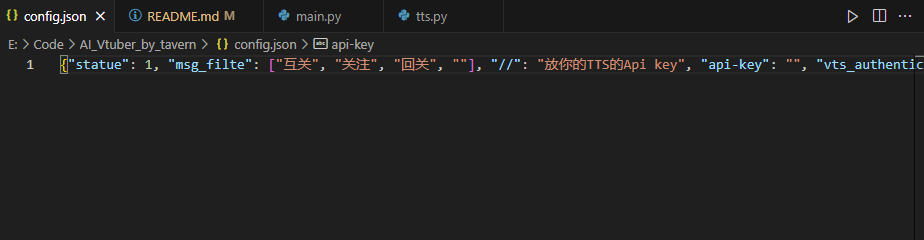

# Bilibili AI 直播主播 Demo
<!-- 

 -->

> 基于 B 站直播接口 + LLM + TTS 的 AI 主播演示项目，支持本地化部署与自定义角色设定

---

## ✨ 功能特性

- 实时处理 B 站直播间弹幕
- 支持主流 LLM API 接入（OpenAI / DeepSeek / 自定义）
- 模块化 TTS 架构（支持 GPT-SoVITS 本地模型）
- 可配置化角色 Prompt 设置
- 无依赖酒馆系统直连方案

---
## 效果展示 
[在你B直播的演示视频](https://www.bilibili.com/video/BV1EDLhzCE9x/)

## 🚀 快速入门

### 1. 配置基础参数
```python
# main.py
live_url = "https://live.bilibili.com/your_room_id"  # 替换为你的直播间地址
llm_api_url = "https://api.your-llm.com/v1/chat/completions"
api_key = "your_api_key_here"
```
 ---
 - 在config.json中放入你的tts api
- （如果你用本地tts可以忽略这一步）

---
- 主播人物prompt可以换成自己的

---
<!--  -->

- 打开main.py，把里面的live_url换成你b站直播间的弹幕请求地址。运行main.py, 第一次vts里可能会请求权限。同意就好。
---
# Version 0.1
· 更改api调用方式，现在不依赖酒馆，直接在main里面放你的api的url，key和b站直播间地址。
· 现在tts新增调用本地api的方式，我用的是gpt-sovits，其他请求方式请根据自己的需求去改。
· tts新增持久化储存


---
废弃的旧版酒馆调用方案：
- ~~启动酒馆，注意要保证是在8000端口~~
- ~~在main中把header替换成你能成功请求的酒馆header~~
- ~~把你想要开启的对话设置成第二个角色（具体看html里面的charID，第二个就是CharID1）~~
- ~~打开vts~~